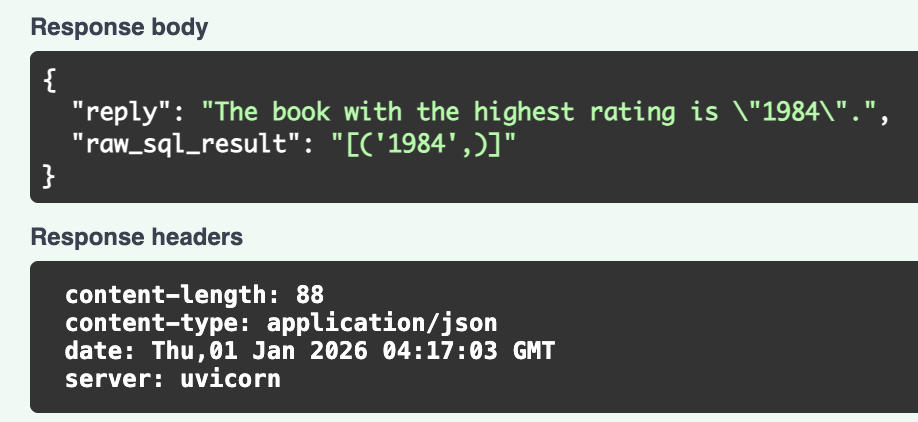
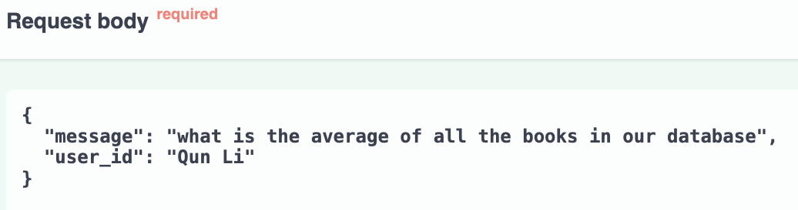
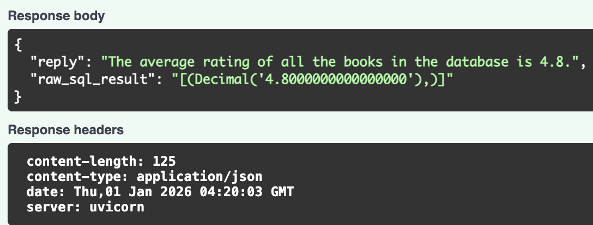

# 🧠 SQL AI Agent — ChatGPT-style Chatbot for Databases

A **ChatGPT-like AI assistant for SQL databases**.  
Ask natural language questions like:
> “Which book has the highest rating?”  
> “Who wrote the best book?”

The system automatically:
1. Understands your question  
2. Converts it into SQL  
3. Queries PostgreSQL  
4. Returns the answer + raw SQL result  

This mirrors how modern companies build **AI data analysts, BI copilots, and internal knowledge bots**.

---

## 🚀 Overview
This project demonstrates a full **LLM-powered SQL Agent pipeline**:
- Natural language → SQL translation
- Multi-table joins & aggregation
- Persistent chat memory
- Production-style REST API

---

## 🧩 Tech Stack

| Category | Tools |
|--------|------|
| LLM / AI | OpenAI GPT (via LangChain), LangChain SQL Agent |
| Memory | LangChain Postgres Chat Memory |
| Backend | FastAPI, Uvicorn |
| Database | PostgreSQL 16 (Docker) |
| ORM / Driver | SQLAlchemy, Psycopg |
| DevOps | Docker, GitHub |
| Env Mgmt | Python `.venv`, `.env` secrets |

---

## 🖥 Live Demo (Real AI → SQL → Database)

### 1️⃣ Highest Rated Book




---

### 2️⃣ Average Rating




---

### 3️⃣ Most Recent Book


---

### 4️⃣ Author of Best Book


---

## 🛠 Run Locally

```bash
docker run --name bookstore-db \
  -e POSTGRES_USER=user \
  -e POSTGRES_PASSWORD=password \
  -e POSTGRES_DB=bookstore \
  -p 5433:5432 \
  -d postgres:16
```

```bash
git clone https://github.com/Eriq7/SQL_AI_Agent.git
cd SQL_AI_Agent
python -m venv .venv
source .venv/bin/activate
pip install -r requirements.txt
echo "OPENAI_API_KEY=your_key_here" > .env
python -m uvicorn main:app --reload
```

Open: http://127.0.0.1:8000/docs

---

## 🔎 Example API Call

```bash
curl -X POST http://127.0.0.1:8000/chat \
  -H "Content-Type: application/json" \
  -d '{
    "message": "Which author wrote the highest rated book?",
    "user_id": "demo_user"
  }'
```
